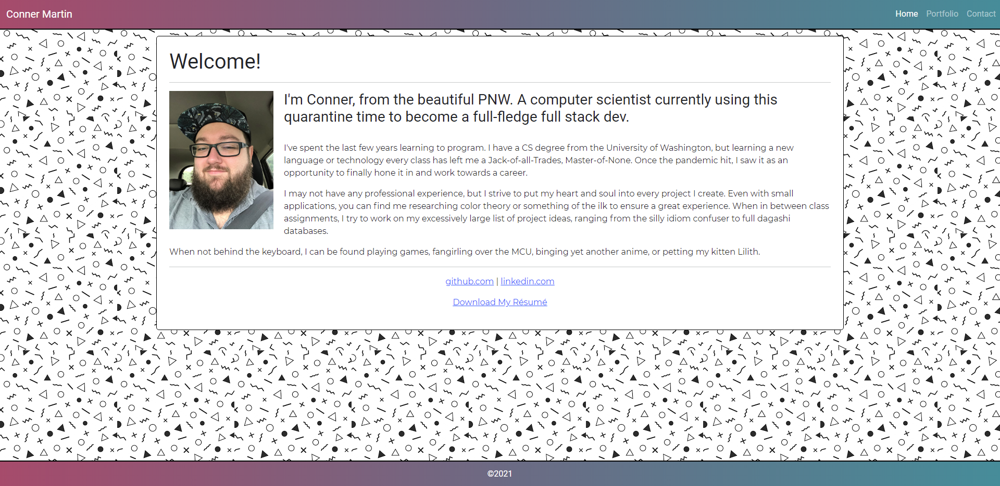

# Portfolio-V.2

## Table of Contents

- [Introduction](#introduction)
- [Technologies](#technologies)
- [Launch](#launch)
- [Images](#images)

## Introduction

The assigment this week was to update the responsive portfolio from week two. While I borrowed some code from the original, I wanted to mostly go from scratch to potentially do things better. I also wanted to make this project as future-proof as possible, which led myself down the path of learning GraphQL API to access GitHub, which was required to get the image of repository. For the most part, I got it! I dedicated hours, built the query, made the headers, got the fetch to return JSON objects. But this API requires a key, which GitHub would not allow the key to be pushed to the repository and they revoked the token.

Dear grader, it works and looks good but you will have to trust me as the API can't be pushed to the codebase and therefore won't show my projects when deployed.

## Technologies

Project created with:

- HTML
- CSS
  - BootStrap 5.0.0
  - Google Fonts
- JavaScript
  - jQuery 3.5.1
- GitHub GraphQL API

## Launch

- [Repository](https://github.com/Connerjm/Portfolio-V.2)
- [Deployment](https://connerjm.github.io/Portfolio-V.2/)

## Images

A picture of my updated portfolio.

